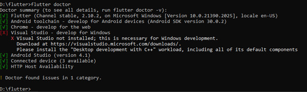
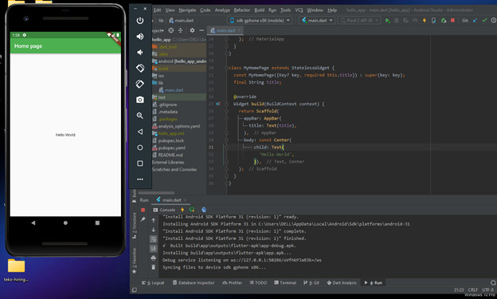
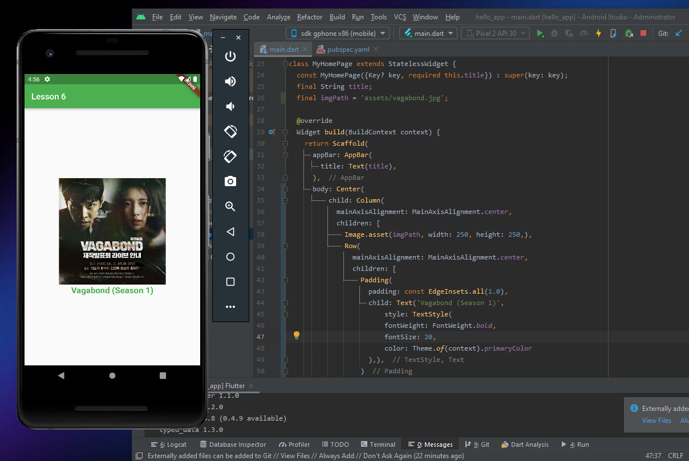
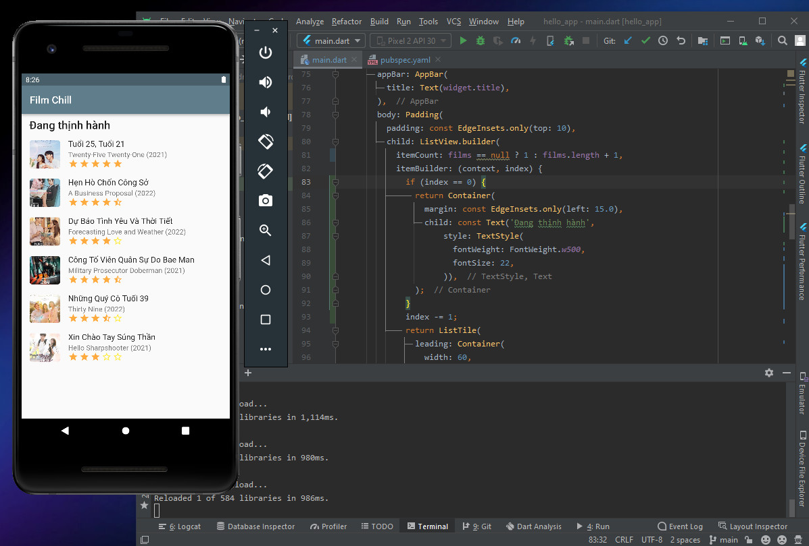
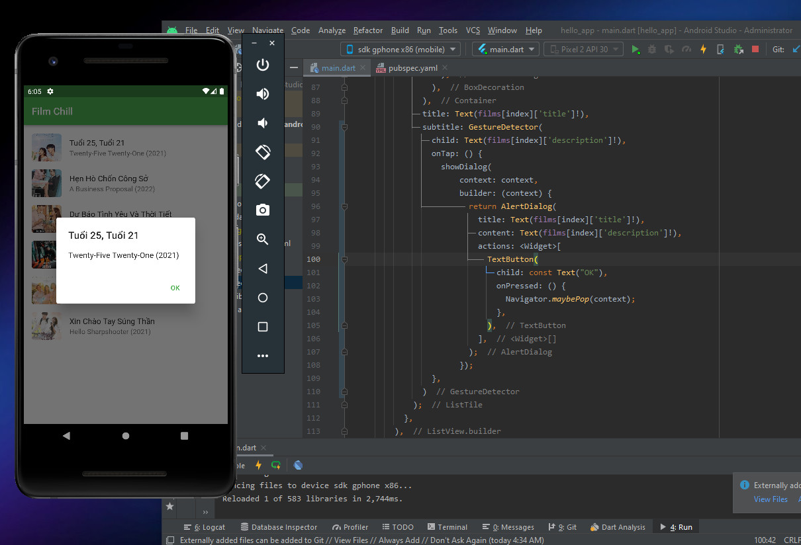
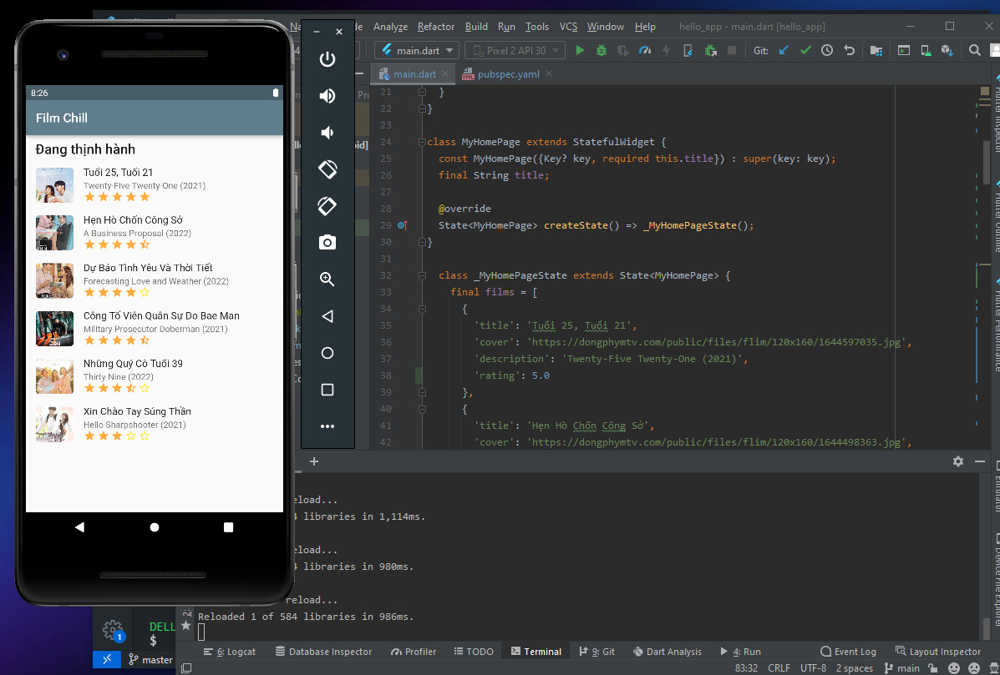
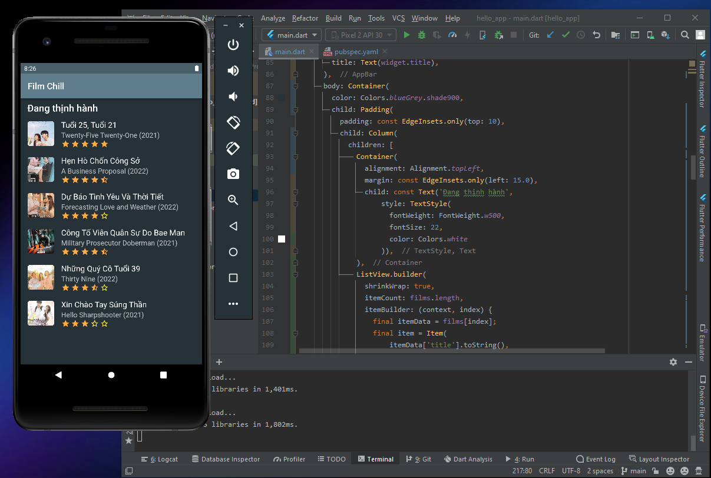
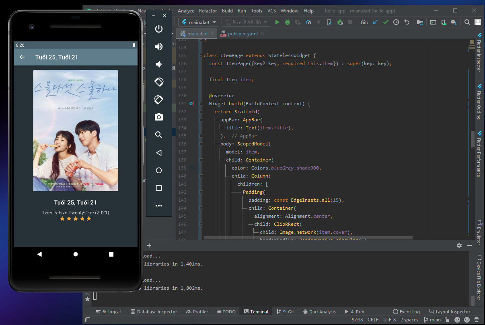
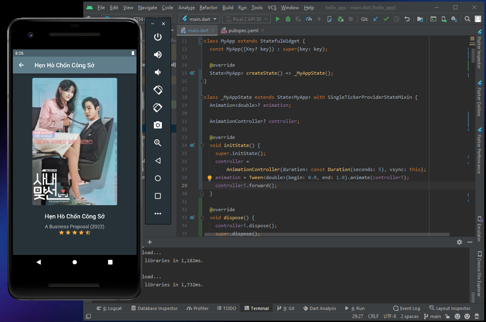

# INT_3120_20 Phát triển ứng dụng di động

Repo báo cáo tiến độ tự học Flutter hàng tuần.

Họ và tên: Nguyễn Văn Hùng | MSV: 19021290

## Tuần 1

- Lesson 1: Tìm hiểu cơ bản về Flutter.

- Lesson 2: Cài đặt môi trường phát triển.
  

- Lesson 3: Chạy thành công Hello app.
  

## Tuần 2

- Lesson 4: Kiến trúc ứng dụng Flutter.
  - Trong Flutter, tất cả đều quy về các widget, một widget phức hợp sẽ bao gồm các widget khác bên trong.
  - GestureDetector widget hỗ trợ các tính năng về tương tác (kéo, vuốt, chạm,...).
  - Trạng thái (state) của widget được quản lý và cập nhật bởi StatefulWidget widget.

- Lesson 5: Tìm hiểu về ngôn ngữ Dart.
  - Là ngôn ngữ lập trình mã nguồn mở đa năng.
  - Được phát triển bởi Google.
  - Là ngôn ngữ lập trình hướng đối tượng sử dụng cú pháp của C (C-style syntax).
  - Không hỗ trợ mảng (array).
  - Hồ trợ các kiểu dữ liệu: Number, String, Boolean, List, Map, Dynamic.
  - Có các cấu trúc điều khiển và vòng lặp.
  - Lập trình với hàm và hướng đối tượng.

- Lesson 6: Widget trong Flutter.
  - Dựa trên chức năng, widget được chia làm 4 nhóm:
    - Các widget giao diện đặc thù theo từng nền tảng - Platform widgets (Material widgets thiết kế theo Material design guideline cho Android OS và Cupertino widgets được thiết kế theo Human Interface Guidelines cho IOS).
    - Các widget hỗ trợ bố trí giao diện - Layout widgets.
    - Các widget quản lý trạng thái - State maintenance widgets.
    - Các widget cơ bản độc lập với nền tảng - Platform independent / basic widgets.

  - Ứng dụng một số widget cơ bản xây dụng giao diện đơn giản:
    - Layout widgets: Center, Column, Row, Padding
    - Platform independent widgets: Text, Image
    - Material widgets: Scaffold, AppBar
    

- Lesson 7: Layout trong Flutter.
  - Dựa trên số widget con, chia làm 2 loại chính:
    - Single Child Widgets - Chỉ có một widget con.
    - Multiple Child Widgets - Có nhiều widget con.
  - Áp dụng tạo layout danh sách phim:
  

- Lesson 8: Gesture trong Flutter.
  - GestureDetector giúp xử lý các sự kiện cử chỉ một cách dễ dàng.
  - Một số cử chỉ phổ biến như: Tap, Double Tap, Drag, Flick, Pinch, Spread, Panning.
  - Áp dụng GestureDetector xử lý sự kiện ấn vào mô tả phim để bật lên dialog thông tin phim:
    

- Lesson 9: Giới thiệu sơ bộ về quản lý State trong Flutter.
  - Dựa trên thời gian tồn tại của state, có thể chia làm 2 loại:
    - Ephemeral (ngắn hạn): kéo dài trong thời gian ngắn, Flutter hỗ trợ quản lý state loại này thông qua StatefulWidget.
    - App state (trạng thái ứng dụng): kéo dài trong toàn bộ app, Flutter hỗ trợ quản lý state loại này thông qua scoped_model.

- Lesson 10: StatefulWidget trong Flutter.
  - Widget được kế thừa từ StatefulWidget  dùng để duy trì trạng thái và quản lý các trạng thái của nó.
  

- Lesson 11: ScopedModel trong Flutter.
  - Flutter có package scoped_model hỗ trợ việc quản lý trạng thái ứng dụng. Package này cung cấp 3 class chính:
    - Model: Model đóng gói trạng thái của một ứng dụng. Model có một phương thức duy nhất là notifyListeners, notifyListeners sẽ thực hiện các công việc cần thiết để cập nhật giao diện.
    - ScopedModel: Đây là widget giúp chuyển Data Model từ widget cha xuống các widget con đồng thời rebuild các widget con giữ các model khi các model được cập nhật.
    - ScopedModelDescendant: Đây là widget lấy Data model từ lớp cha và build UI khi Data model thay đổi.

- Lesson 12: Navigator và Routing.
  - Flutter cung cấp lớp routing cơ bản là MaterialPageRoute cùng 2 phương thức Navigator.push() và Navigator.pop().
    - MaterialPageRoute: Đây là widget dùng để render màn hình mới, có thể đi cùng với một hiệu ứng chuyển cảnh.
    - Navigation.push(): Đây là phương thức dùng để chuyển sang màn hình mới.
    - Navigation.pop(): Đây là phương thức dùng để quay lại màn hình trước đó.
  
    
    

- Lesson 13: Animation.
  - Animation: Tạo ra giá trị và được thêm vào giữa hai số (bắt đầu và kết thúc animation). Các kiểu animation thường được sử dụng là: Animation, Animation, Animation.
  - AnimationController: đối tượng animation đặc biệt dùng để điều khiển các hiệu ứng của chính nó. Nó tạo ra các giá trị mới bất cứ khi nào ứng dụng sẵn sàng cho một frame mới, hỗ trợ các animation tuyến tính.
  - CurvedAnimation: cơ bản giống như AnimationController nhưng hỗ trợ animation phi tuyến tính.
  - Tween: kế thừa từ Animatable và tạo các giá trị bất kì khác 0 và 1. Nó được sử dụng cùng với đối tượng animation bởi phương thức animate().

    

- Lesson 14: Code với native Android.
  - Flutter cung cấp framework chung để truy cập vào các nền tảng có tính năng riêng biệt thông qua giao thức đơn giản là messaging. Client (Flutter code), mã nền tảng và Host liên kết với một thông báo chung gọi là Message Channel.