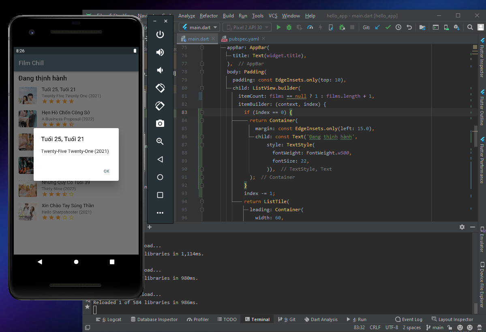

# INT_3120_20 Phát triển ứng dụng di động

Repo báo cáo tiến độ tự học Flutter hàng tuần.

Họ và tên: Nguyễn Văn Hùng | MSV: 19021290

## Tuần 1

- Lesson 1: Tìm hiểu cơ bản về Flutter.

- Lesson 2: Cài đặt môi trường phát triển.
  

- Lesson 3: Chạy thành công Hello app.
  

## Tuần 2

- Lesson 4: Kiến trúc ứng dụng Flutter.
  - Trong Flutter, tất cả đều quy về các widget, một widget phức hợp sẽ bao gồm các widget khác bên trong.
  - GestureDetector widget hỗ trợ các tính năng về tương tác (kéo, vuốt, chạm,...).
  - Trạng thái (state) của widget được quản lý và cập nhật bởi StatefulWidget widget.

- Lesson 5: Tìm hiểu về ngôn ngữ Dart.
  - Là ngôn ngữ lập trình mã nguồn mở đa năng.
  - Được phát triển bởi Google.
  - Là ngôn ngữ lập trình hướng đối tượng sử dụng cú pháp của C (C-style syntax).
  - Không hỗ trợ mảng (array).
  - Hồ trợ các kiểu dữ liệu: Number, String, Boolean, List, Map, Dynamic.
  - Có các cấu trúc điều khiển và vòng lặp.
  - Lập trình với hàm và hướng đối tượng.

- Lesson 6: Widget trong Flutter.
  - Dựa trên chức năng, widget được chia làm 4 nhóm:
    - Các widget giao diện đặc thù theo từng nền tảng - Platform widgets (Material widgets thiết kế theo Material design guideline cho Android OS và Cupertino widgets được thiết kế theo Human Interface Guidelines cho IOS).
    - Các widget hỗ trợ bố trí giao diện - Layout widgets.
    - Các widget quản lý trạng thái - State maintenance widgets.
    - Các widget cơ bản độc lập với nền tảng - Platform independent / basic widgets.

  - Ứng dụng một số widget cơ bản xây dụng giao diện đơn giản:
    - Layout widgets: Center, Column, Row, Padding
    - Platform independent widgets: Text, Image
    - Material widgets: Scaffold, AppBar
    

- Lesson 7: Layout trong Flutter.
  - Dựa trên số widget con, chia làm 2 loại chính:
    - Single Child Widgets - Chỉ có một widget con.
    - Multiple Child Widgets - Có nhiều widget con.
  - Áp dụng tạo layout danh sách phim:
  

- Lesson 8: Gesture trong Flutter.
  - GestureDetector giúp xử lý các sự kiện cử chỉ một cách dễ dàng.
  - Một số cử chỉ phổ biến như: Tap, Double Tap, Drag, Flick, Pinch, Spread, Panning.
  - Áp dụng GestureDetector xử lý sự kiện ấn vào mô tả phim để bật lên dialog thông tin phim:
    
